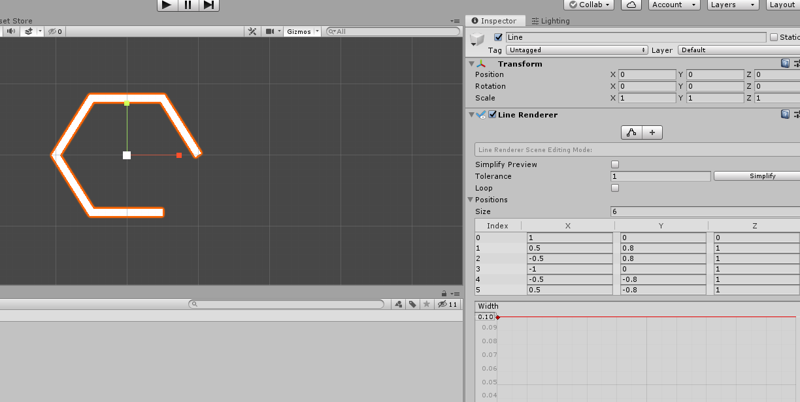

# Super Hexagon

Prosta gra polegająca na manewrowaniu pomiędzy kolejnymi pierścieniami. Wprawnemu programiście napisanie jej zajmuje 10 minut ([źródło](https://www.youtube.com/watch?v=p8MzsDBI5EI)), nam zajmie 2 godziny.

## Początek

Zaczniemy od stworzenia nowego projektu w 2 wymiarach. W głównej scenie stworzymy nowy obiekt 2D - `Sprite`, który nazwiemy `Player`. W ustawieniach `Sprite Renderer` damy mu `Sprite` równy `Knob` - da nam to prosty efekt białej kulki. Powiekszymy nasz obiekt `Player`, po czym dodamy mu komponent `Rigidbody 2D`, z ustawieniem `Body Type` na `Kinematic`.

## Ruch postaci

Pierwszy skrypt - musimy dodać naszej kulce możliwość ruchu. Dodajemy jej nowy komponent skryptowy o nazwie `PlayerScript`. 

Skorzystamy z dwoch funkcji:

- `Input.GetAxisRaw("Horizontal")`
- `transform.RotateAround(Vector3.zero, Vector3.forward, Angle)`

wewnątrz funkcji `Update()`.

Nasz element będzie się kręcił wokół osi wychodzącej z kamery, w punkcie zero. Aby to było możliwe, musimy go trochę oddalić - np. ustawiając wartość współrzędnej `y` na 2.

## Kształt przeszkód

Teraz stworzymy obiekt `Line`. Taki obiekt ma własność tworzenia krzywej o dowolnej liczbie punktów. W komponencie `Line Renderer` uzupełnimy 6 punktów o następujące współrzędne:

|     x |     y |    z |
| ----: | ----: | ---: |
|  1.00 |  0.00 | 0.00 |
|  0.50 |  0.87 | 0.00 |
| -0.50 |  0.87 | 0.00 |
| -1.00 |  0.00 | 0.00 |
| -0.50 | -0.87 | 0.00 |
|  0.50 | -0.87 | 0.00 |



Następnie, dodajemy do naszego heksagonu komponent `Edge Collider 2D` i w liście wierzchołków wpisujemy te same współrzędne. Dodatkowo, zaznaczamy kontrolkę `Is Trigger`.

## Skrypt heksagonu

Teraz najważniejszy kawałek - heksagony będą tworzyły się duże, z losowym kątem, po czym będą się zmniejszały. Jeśli heksagon dotknie gracza, gra jest resetowana na początek. Jeśli heksagon uzyska minimalny rozmiar, jest kasowany.

- `using UnityEngine;`
- `using UnityEngine.SceneManagement;`
- `transform.Rotate(Vector3.forward, Random.Range(0f, 360f));`
- `Size -= Speed * Time.deltaTime;`
- `transform.localScale = Size * Vector3.one;`
- `Destroy(gameObject);`

```csharp
private void OnTriggerEnter2D(Collider2D collider)
{
SceneManager.LoadScene(SceneManager.GetActiveScene().buildIndex);
}
```

## Spawner

Gra z jednym heksagonem jest dość nudna. Dlatego stworzymy obiekt spawnujący w określonych odcinkach czasu kolejne heksagony. Wybieramy opcję `Create Empty` z listy obiektów i dodajemy mu `SpawnerScript`:

- `Instantiate(HexagonGameObject, Vector3.zero, Quaternion.identity);`

## Timer

Możemy jeszcze dopisać opcję timera - im dłużej gramy, tym wyższy wynik mamy nabity (w sekundach i setnych sekund). Dodatkowo ciekawą atrakcją będzie pamiętanie przez program naszych najlepszych wyników - i aktualizacja w przypadku gdy uda nam się któryś przebić.

### TimerScript

```csharp
using System;
using UnityEngine;
using UnityEngine.UI;

public class TimerScript : MonoBehaviour
{
    private float time;

    private void Update()
    {
        time += Time.deltaTime;
        var seconds = Convert.ToInt32(time);
        var miliseconds = Convert.ToInt32(time * 100 % 100);
        GetComponent<Text>().text = $"{seconds:D2}:{miliseconds:D2}";
    }
}
```

### BestTimerScript


```csharp
using System;
using UnityEngine;
using UnityEngine.UI;

public class BestTimerScript : MonoBehaviour
{
    private float bestTime;

    private float time;

    // Start is called before the first frame update
    private void Start()
    {
        bestTime = PlayerPrefs.GetFloat("BestTime", 0);
        var seconds = Convert.ToInt32(bestTime);
        var miliseconds = Convert.ToInt32(bestTime * 100) % 100;
        GetComponent<Text>().text = $"{seconds:D2}:{miliseconds:D2}";
    }

    // Update is called once per frame
    private void Update()
    {
        time += Time.deltaTime;
        if (time > bestTime)
        {
            bestTime = time;
            PlayerPrefs.SetFloat("BestTime", bestTime);
            var seconds = Convert.ToInt32(bestTime);
            var miliseconds = Convert.ToInt32(bestTime * 100) % 100;
            GetComponent<Text>().text = $"{seconds:D2}:{miliseconds:D2}";
        }
    }
}
```

